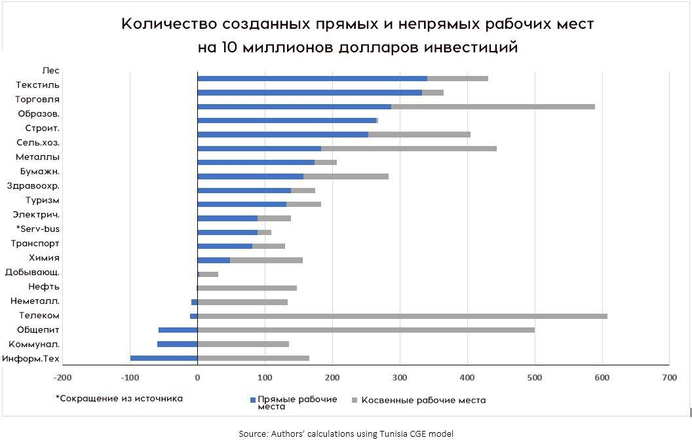

Продолжая тему поста про технологии и рабочие места (https://t.me/redzion/18612) — из того же исследования, в котором считали стоимость создания новых рабочих мест на примере Туниса. 

Перевели график Всемирного Банка.
По вертикали — сектора экономики, например торговля, строительство, телекоммуникации. По горизонтали — количество рабочих мест, которые в этих секторах можно создать, если проинвестировать десять миллионов долларов в новый проект.

Очевидные лидеры по количеству рабочих мест — лесообрабатывающая/заготавливающая промышленность, текстиль, торговля. Причём торговля создаёт много косвенных рабочих мест — можно вспомнить доставку товаров и обслуживание складов. 

Но больше всего косвенных работ создаёт телеком. С учётом таких рабочих мест он выходит на первое место по "трудоёмкости".

Резкий контраст — айти. Там вложение в десять миллионов создаст -100 (минус сто) рабочих мест. 
Как так? А просто основная деятельность айти-индустрии — автоматизация всего. Вот они и автоматизируют.
